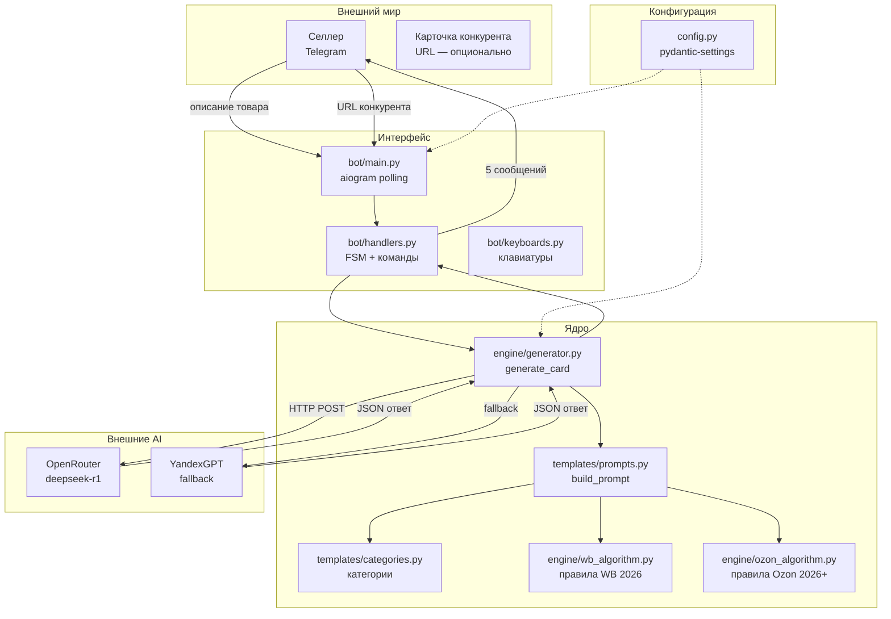

# Карта системы

## Компоненты

| Компонент | Файл | Ответственность |
|---|---|---|
| Точка входа | `bot/main.py` | Запуск polling, инициализация бота |
| Хендлеры | `bot/handlers.py` | FSM, команды, обработка ввода, вывод результатов |
| Клавиатуры | `bot/keyboards.py` | Клавиатуры категорий, результатов, действий |
| Генератор | `engine/generator.py` | Вызов AI, парсинг JSON, сборка CardResult |
| Промты | `templates/prompts.py` | Сборка промта из правил + описания товара |
| Категории | `templates/categories.py` | 7 категорий, списки характеристик |
| Алгоритм WB | `engine/wb_algorithm.py` | Правила ранжирования WB (версия 2026.1) |
| Алгоритм Ozon | `engine/ozon_algorithm.py` | Правила ранжирования Ozon (версия 2026.1+) |
| Конфигурация | `config.py` | Загрузка .env, pydantic Settings |
